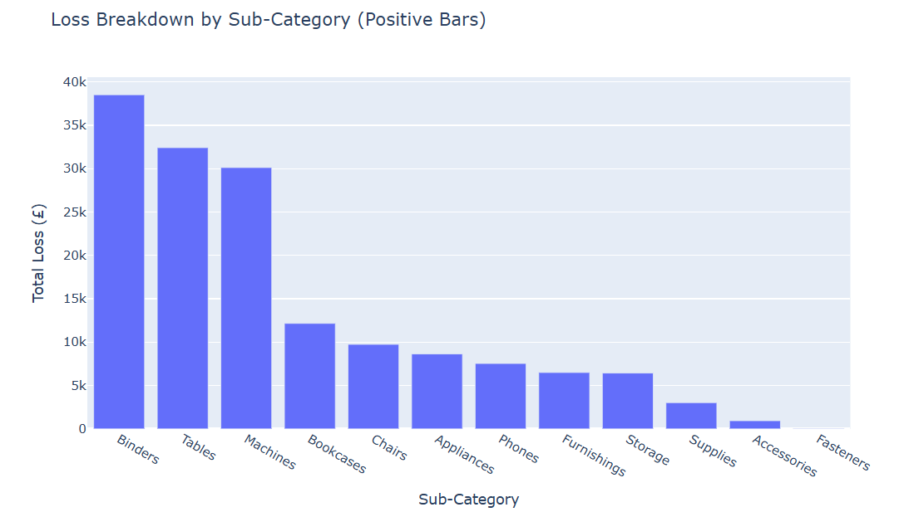
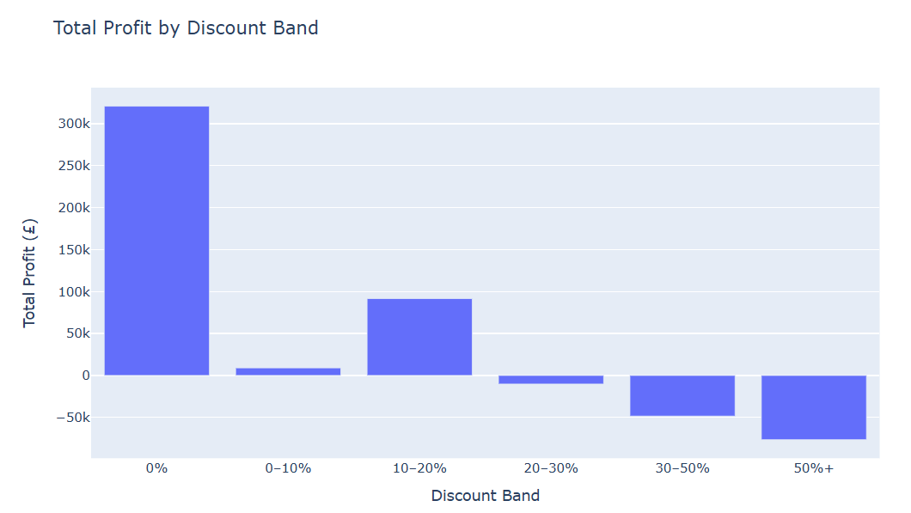
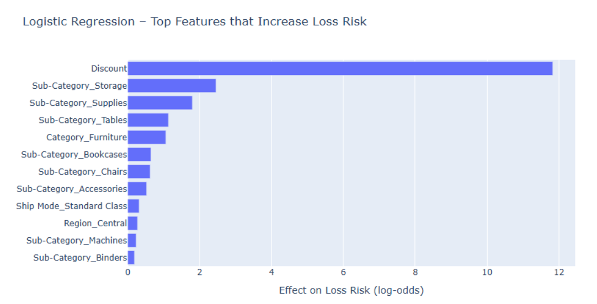
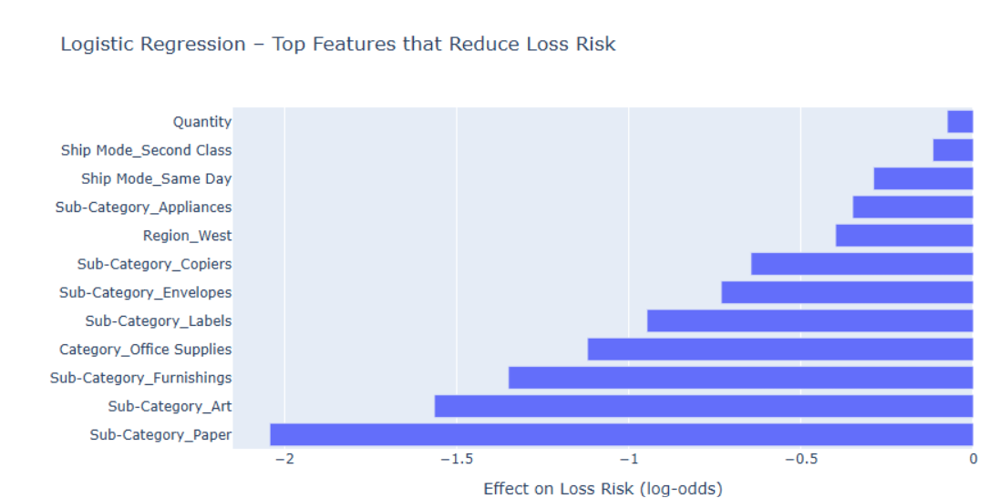
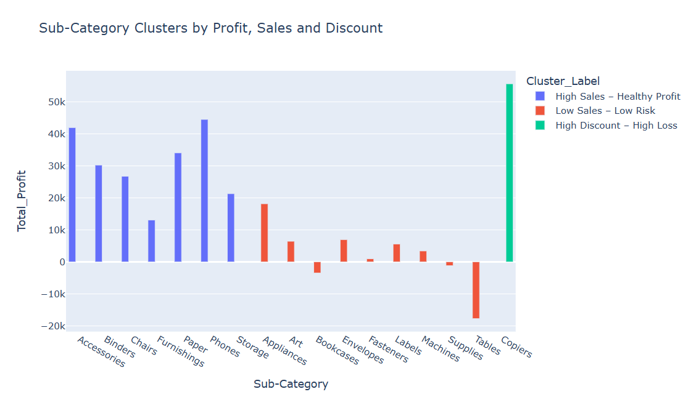

# Finding the Orders That Lose Money

A retail business was making money overall but losing it on thousands of individual orders. This project works out which orders those are, why it happens, and whether you can spot one coming before it's too late.

---

## The dataset

The public **Superstore** dataset: a US office-supplies retailer's complete sales record.

- **9,994 orders** placed between 2014 and 2017
- **21 columns** covering what was sold, to whom, where, when, at what price and discount, and how much profit or loss it made
- Products span three categories — Furniture, Office Supplies and Technology — split into 17 sub-categories like Chairs, Binders and Phones

Four years of real trading, one row per item sold.

## The question

Across those four years the business sold £2.3m and kept £286,000 in profit. Healthy enough.

But that net figure hides something. Add up only the orders that lost money and it comes to **£156,131**. The business was making a lot and giving a big chunk of it back, order by order, without anyone tracking which ones.

So the question I set out to answer was not "are we profitable". It was: **which orders lose money, and can we see them coming?**

---

## Step 1 — Checking the data before trusting it

Before analysing anything I looked for values that couldn't be real.

A handful of orders recorded **10,000 units** when a typical order is 3. A couple recorded **discounts above 100%**, which would mean paying customers to take goods away. Those are data-entry errors and I removed them.

I deliberately kept the extreme *losses*, though. One order lost £6,599 — a 3D printer with a list price near £3,000 sold at a 70% discount. That looks like an outlier until you check it, and then it makes complete sense. Those orders are the entire point of the analysis. Deleting them would have deleted the problem.

**The principle: remove what's impossible, keep what's merely surprising.**

## Step 2 — Finding where the money goes

Two things stood out.

**The losses are concentrated, not spread.** Most sub-categories make money. Three don't: **Tables, Bookcases and Supplies** are loss-making across the whole four years. Tables alone loses £17,700. Everything else is broadly fine.

**Discounting is what causes it.** Sorting every order by how much discount it carried:

| Discount given | Total profit |
|---|---|
| 0–10% | +£319,000 |
| 10–20% | +£85,000 |
| 20–30% | −£2,000 |
| 30–50% | −£48,000 |
| Over 50% | −£77,000 |

Below 20% the business makes money. Above 30% it loses money on essentially every order. There's no grey area.

## Step 3 — The model that didn't work

My first plan was to predict how much profit each order would make. I tried two standard approaches.

**Ridge Regression** and **Random Forest**. Both failed, and they failed in different ways.

Ridge scored **−0.61** on data it hadn't seen. That number matters: zero would mean "no better than just guessing the average every time", so a negative score means it was *worse than guessing*. Random Forest scored 0.96 on the data it learned from and **−0.06** on new data — it had memorised the answers rather than learned the pattern.

Why? Profit per order in retail isn't a smooth thing you can predict. It jumps around based on discount tiers and product economics. And this dataset has no cost information, so the model was being asked to work out profit without knowing what anything cost to buy.

**I stopped rather than forcing it.** A model with a negative score isn't a model.

## Step 4 — Changing the question

The failure was useful, because it made me ask what the business actually needs.

Nobody needs to know an order will make £4.12. They need to know **whether an order is about to lose money**, early enough to do something about it.

That's a yes/no question, not a number. And yes/no questions are much easier to answer.

## Step 5 — The model that worked

I built a **Logistic Regression** classifier — a model that answers "will this order lose money?" with a probability.

Tested on 2,999 orders it had never seen:

| Measure | Result | What it means |
|---|---|---|
| Accuracy | **94%** | It gets the answer right 94 times out of 100 |
| ROC-AUC | **0.98** | How well it separates losing orders from profitable ones. 0.5 is a coin flip, 1.0 is perfect |
| Precision | **94%** | When it says "this will lose money", it's right 94% of the time |
| Recall | **74%** | It catches 74% of the orders that actually lose money |

In plain terms: out of 561 loss-making orders it correctly flagged **414**, and only wrongly accused **25** profitable orders out of 2,438.

Everything it uses — the price, the discount, the quantity, the product type, the region — is known *before* the sale is finalised. So it can score an order while there's still time to change it.

The model also shows what actually drives the risk. Discount dominates everything else:

And what protects against it:

## Step 6 — Grouping the orders

Finally I used **K-Means clustering**, which sorts orders into groups based on how similar they are, without being told what to look for.

It found three:

| Group | Orders | Average discount | Average profit |
|---|---|---|---|
| Ordinary business | 8,824 | 9% | +£38 |
| **The problem group** | **1,131** | **65%** | **−£109** |
| Big-ticket sales | 39 | 8% | +£2,023 |

That middle group is 11% of all orders and destroys **£123,731**. Heavily discounted, reliably loss-making, and easy to identify. If this business fixed one thing, it would be that group.

---

## What I'd tell the business

1. **Cap discounts by product type.** The data shows exactly where each cutoff sits. Above it, you lose money every time.
2. **Review Tables, Bookcases and Supplies.** They lose money consistently, not occasionally. Either the pricing or the buying is wrong.

---

## The files

| File | What it is |
|---|---|
| `retail_profitability_analysis.ipynb` | The full analysis, start to finish |
| `model_only.py` | Just the modelling, if you want to check the numbers quickly |
| `superstore.csv` | The data |
| `requirements.txt` | What you need installed |
| `images/` | Charts from the analysis |

---

**Wasiq Irfan** — [LinkedIn](https://www.linkedin.com/in/wasiq-irfan-315623238/)
